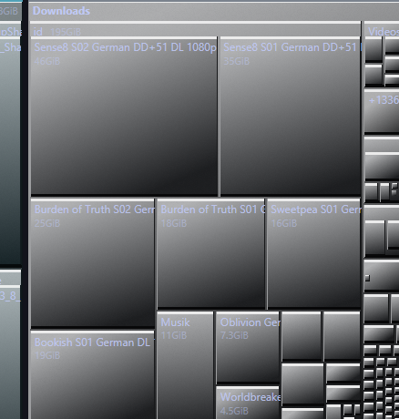
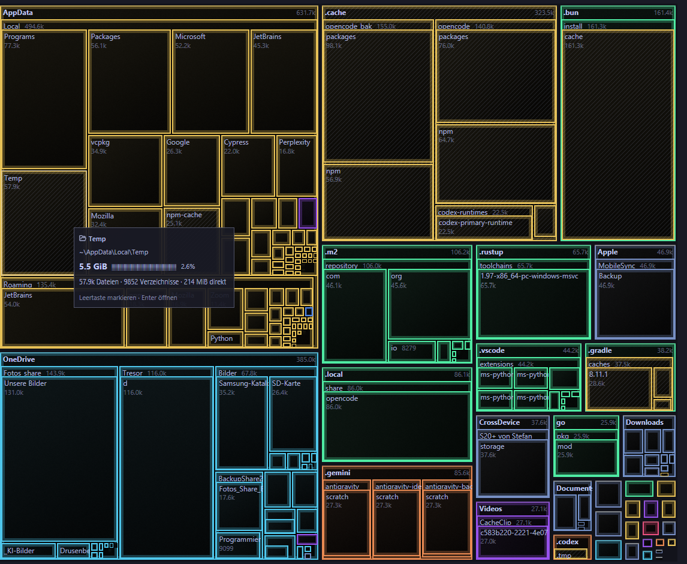
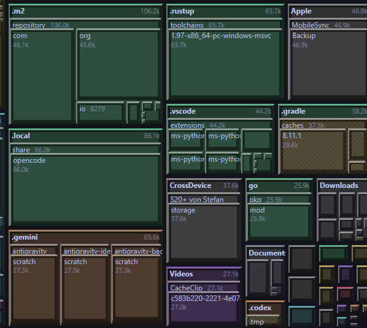
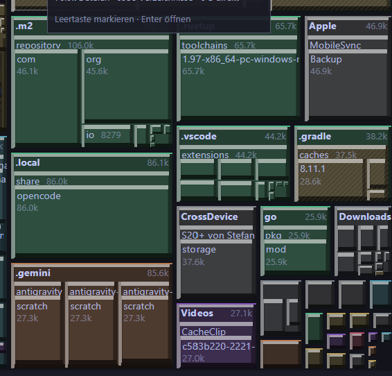
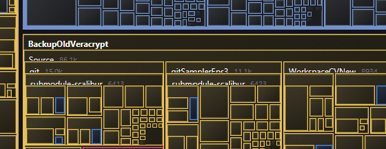
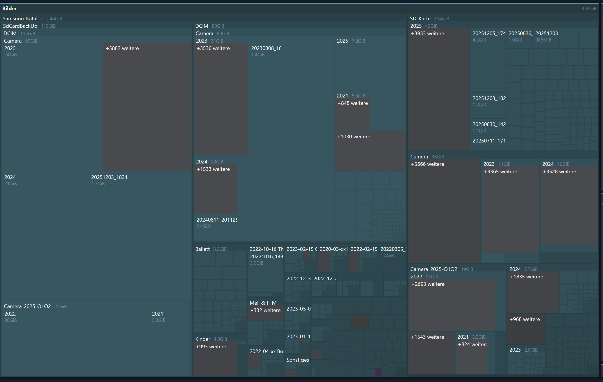
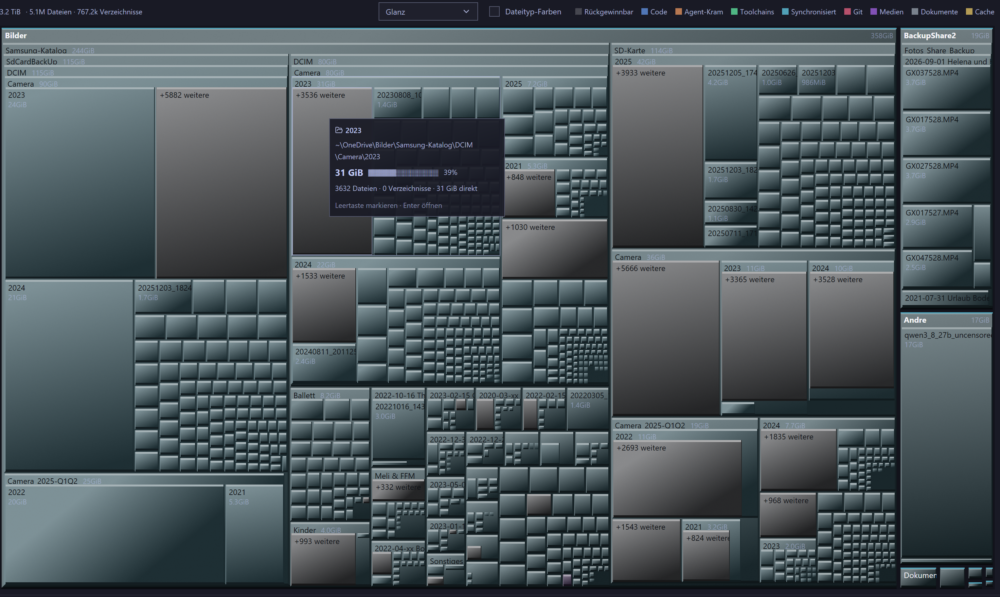
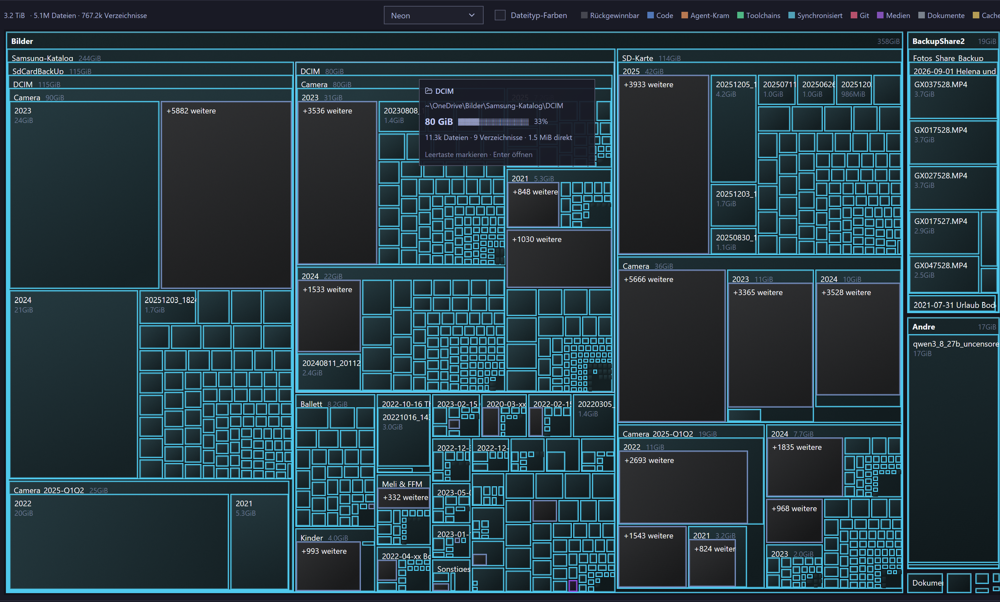

## Ziel

Der aktuelle 3D-Block-Stil gefaellt nicht. Statt eines einzelnen Looks soll ein **Dropdown**
zwischen **acht Varianten** waehlen. Variante 1 ist der **bisherige** Look und Default.
Jede Variante passt sich der jeweiligen **Basis-Kachelfarbe** an (Kategorie- oder Dateityp-Farbe).

## Toolkit-Grenzen (belegt, bestimmen die Umsetzung)

`gpui-pre-0.3.6/src/color.rs:779-898`: `Background` kennt nur Solid, LinearGradient mit
**genau zwei** Stops, `pattern_slash` und `checkerboard`. **Kein Radial-Verlauf, kein Blur,
kein `box-shadow`.** Kacheln werden auf dem Canvas gemalt (keine Elemente), Element-Schatten
wie `.shadow_lg()` greifen dort nicht. Kanten gehen als Border-Quads mit Breite je Seite
(hell oben/links, dunkel unten/rechts) - so machen wir es heute schon.

Uebersetzung der CSS-Vorlagen:

| CSS | gpui-Naeherung |
| --- | --- |
| `linear-gradient` mit 3+ Stops | 2 Stops (Mittelstops entfallen) |
| `radial-gradient(...)` (Highlight) | 2-3 konzentrische, nach innen hellere Quads ODER diagonaler Linear-Gradient |
| `box-shadow: inset ...` | zusaetzliche Border-Quads (harte Kante statt weich) |
| `box-shadow: 0 2px 4px` (Drop) | moeglich als dunkles, versetztes Quad VOR allen Kacheln gemalt; sonst weglassen |
| `border-top/left/right/bottom` versch. | zwei Border-Quads (Breite je Seite) |
| `inset 0 0 0 4px <farbe>` (Innenring) | Border-Quad mit gleicher Breite auf allen Seiten |
| `inset 0 0 14px` (Glow) | 2-3 Quads mit abnehmender Alpha uebereinander |

## Varianten (aus der Vorlage des Nutzers)

1. **Classic** - bisheriger Look (linearer Gradient hell->dunkel + Bevel). Default.
2. **Gloss** - radiales Highlight oben links + diagonaler Verlauf; heute: Highlight naeherungsweise
   als aufgehellte Innenflaeche.
3. **Neon** - dunkler Verlauf, 1 px Cyan-Rand, innen/aussen leuchtend (Glow genaehert).
4. **Anodized** - mehrstufiger Metallverlauf mit heller Kante.
5. **Embossed** - Vollton mit weichem Innenrelief und 4 px Innenring.
6. **Grain** - radialer Verlauf mit Innenkanten und Drop-Schatten.
7. **Chiseled** - Vollton mit vier unterschiedlich dicken, verschiedenfarbigen Kanten + Innenglow.
8. **Prism** - Verlauf mit hartem Knick in der Mitte und duennen Innenkanten.

Die im CSS genannten Hex-Werte sind **Beispiele**: pro Variante muss aus der Basis-Kachelfarbe
gerechnet werden (Hue bleibt, Helligkeit/Saettigung je Stufe), damit jede Kachel in ihrer Farbe bleibt.

## UI

- Dropdown in der Legenden-Zeile, direkt neben dem Haken `3D blocks`; auswaehlbar nur, wenn der Haken an ist.
  Bausteine: `gpui_omarchy::select`/`combobox` (`gpui-omarchy-0.1.3/src/lib.rs:55`) oder das vorhandene
  `button_group` (Size/Files/Age).
- Beschriftungen ueber i18n (en identisch, de uebersetzt); README-Abschnitt ergaenzen.

## Test-Tier

Tier 1: Farbmathematik je Variante als reine Funktion (hell/dunkel unterscheidbar, Hue stabil,
Wertebereiche geklemmt) mit Unit-Tests; Harness-Test, dass die Dropdown-Wahl in der Mosaik-Frame-Daten
ankommt und `3D blocks` aus den flachen Look unveraendert laesst.
Sichtpruefung der acht Varianten bleibt beim Menschen (Screenshot).

### Akzeptanzkriterien
- [x] Ein Dropdown bietet acht Block-Stile; Variante 1 'Classic' ist der bisherige Look und der Default.
- [x] Die Wahl wirkt sofort auf das Mosaik, solange der Haken '3D blocks' aktiv ist; mit dem Haken aus bleibt der heutige flache Look unveraendert.
- [x] Jede Variante berechnet ihre Farben und Flaechen relativ aus der Basis-Kachelfarbe (Kategorie- oder Dateityp-Farbe); der Farbton bleibt erhalten, es werden keine festen Hex-Werte verwendet.
- [x] Alle acht Varianten sind mit den vorhandenen gpui-Primitiven malbar und sichtbar unterscheidbar; Radial-Verlaeufe, Blur und Box-Shadow sind durch geschichtete Quads bzw. Kanten angenaehert und im Code begruendet.
- [x] Die Farbmathematik je Variante ist eine reine, geklemmte Funktion und durch Unit-Tests abgedeckt (helle und dunkle Enden unterscheidbar, Hue stabil).
- [x] Die Dropdown-Beschriftungen laufen ueber i18n (en und de vollstaendig); der README-Abschnitt zu den erhabenen Bloecken nennt die Varianten.
- [x] cargo xtask lint und cargo xtask test bleiben gruen.
- [x] Umfang (Nutzerentscheidung): Der separate Haken '3D blocks' entfaellt; das Dropdown ist die einzige Steuerung und der Block-Look ist immer aktiv (Default Classic). [neu@2026-10-02T05:45:34.519964300Z]
- [x] Rework: 'Classic' ist der FLACHE Look (die urspruengliche einfarbige Darstellung ohne Bevel/Verlauf) und bleibt der Default; der alte 3D-Block entfaellt. [neu@2026-10-02T06:16:47.044432Z]
- [x] Rework Textfarbe: Die Beschriftung waehlt ihre Farbe je Kachel nach der Helligkeit der oberen linken Flaeche (luminanz > 127 => dunkle Schrift, sonst helle), damit auf hellen Stilen wie Eloxiert und Koernung der Text lesbar bleibt. [neu@2026-10-02T06:16:47.044432Z]
- [x] Rework Neon: duennere Kanten und duennerer Glow, hellerer Koerper - die Basisfarbe der Kachel muss sichtbar bleiben. [neu@2026-10-02T06:16:47.044432Z]
- [x] Rework Gemeisselt: die hellen Linien (besonders oben) sind duenner. [neu@2026-10-02T06:16:47.044432Z]
- [x] Rework Gepraegt: 2 px mehr Abstand zwischen Text und Kachelrand (Innenring nicht ueberlaufen). [neu@2026-10-02T06:16:47.044432Z]
- [x] Rework Beleg: Sichtpruefung der ueberarbeiteten Stile durch den Menschen (Screenshots). [neu@2026-10-02T06:16:47.044432Z]
- [x] Nacharbeit 2: Die Kachel-Beschriftung (Name und Groesse) wird in keiner Variante mehr unten abgeschnitten; Neon, Eloxiert, Gepraegt, Koernung und Gemeisselt zeigen den Text vollstaendig. [neu@2026-10-02T08:51:27.990234200Z]
- [x] Nacharbeit 2: Bei 'Glanz' bleibt die Grundfarbe der Kachel erkennbar (weniger Aufhellung im Verlauf, gedaempfte Kanten), damit die Kacheln weiter zur Legende passen. [neu@2026-10-02T08:51:27.990234200Z]
- [x] Nacharbeit 2: Sichtpruefung dieser beiden Punkte durch den Menschen per Screenshot (Neon ohne Textabschnitt, Glanz mit erkennbarer Grundfarbe). [neu@2026-10-02T08:51:27.990234200Z]
### Audit-Log & Agenten-Notizen
- **2026-10-02 05:33:12 (build-opencode):** Ticket claimed by build-opencode
- **2026-10-02 05:33:12 (build-opencode):** Entscheidungen des Nutzers: nur Dropdown (ersetzt den 3D-Haken), Classic ist Default, Dropschatten wird umgesetzt, Neon darf die Basis stark abdunkeln. Zusaetzlich: temporaere Diagnose-Tests aus DISK-12 werden entfernt.
- **2026-10-02 05:45:34 (build-opencode):** 1 Akzeptanzkriterien ergaenzt
- **2026-10-02 05:45:34 (build-opencode):** Umgesetzt in Commit 9d2a12c.

• palette.rs: enum BlockStyle (8 Varianten, Default Classic) mit value()/label()/from_value(); Edge (Breite in Bevel-Einheiten + Farbe); BlockLook (Koerper als Vollton oder 2-Stop-Gradient, vier Kanten, optionaler Innenring, Dropschatten-Flag) und die reine Funktion block_look(style, base). Alle Farben werden aus der Basis-Kachelfarbe gerechnet (mix Richtung Weiss/Schwarz), Neon nutzt eine stark gesaettigte, aufgehellte Variante des eigenen Farbtons und dunkelt den Koerper stark ab.
• treemap_view.rs: Mosaic.blocks_3d -> Mosaic.block_style; paint_tiles nimmt die Variante; neuer Dropschatten-Pass (dunkles, um eine Bevel-Hoehe versetztes Quad UNTER allen Kacheln, nur fuer Stile mit shadow=true und Kacheln > 6 px); paint_block zeichnet Koerper + optionalen Ring + Kanten (2 Quads, wenn oben/unten bzw. links/rechts gleich sind, sonst 4 Einzelkanten - fuer Chiseled). Kacheln < 6 px behalten nur den Koerper.
• state.rs: block_style + block_choice (Entity<ChoiceState>), ensure_block_choice() baut den Picker in der ersten Frame (dort gibt es erst ein Window) und beobachtet die Auswahl; set_block_style() nur fuer Tests (cfg(test)), weil die App den Observer nutzt.
• views.rs: rendering_toggles -> Picker (gpui_omarchy::select) + der File-type-colors-Haken; trail_and_legend bekommt window durchgereicht. Feste Breite (9.5 rem), damit ein langer Stilname die Legende nicht schiebt.
• i18n: Block style + Classic/Gloss/Neon/Anodized/Embossed/Grain/Chiseled/Prism (en/de). README-Abschnitt neu geschrieben (8 Stile, Base-Color-Regel, gpui-Naeherung).

ABWEICHUNG: Kriterium 2 der urspruenglichen Fassung ('solange der Haken 3D blocks aktiv ist ... mit dem Haken aus bleibt der flache Look') ist durch die Nutzerentscheidung 'Nur Dropdown, Classic ist Default' ueberholt; der separate Haken ist entfernt und der Block-Look ist immer aktiv. Kriterium 2 bleibt deshalb offen und wird durch das neue Kriterium 8 ersetzt. Folge auch fuer DISK-4: dessen Kriterium 'mit beiden Haken aus = heutiger flacher Look' gilt nicht mehr.
Verifikation Tier 1: cargo xtask lint gruen; cargo xtask test gruen (77 App-Tests, 141 Core-Tests). Neu/angepasst: tests::the_block_style_and_the_extension_toggle_reach_the_mosaic (Default ist Classic, jede Variante erreicht das Mosaik), palette-Tests every_block_style_derives_its_look_from_the_tile_colour, every_block_style_is_a_distinct_look, a_style_value_round_trips_and_defaults_to_classic sowie der angepasste Classic-Kontrasttest. Sichtpruefung der acht Varianten bleibt beim Menschen.

### Screenshots

### Review-Feedback
- **2026-10-02 05:57:17 (human):** Du hast mich falsch verstanden. "Klassisch" meinte für mich den FLACHEN Look, der ursprünglich in der App drin war. 
Zu den einzelnen Themes: Evaluiere, ob oben links eher hell ist (>127) oder dunkel und ändere die Textfarbe entsprechend. Weil so sieht man oft den Text überhaupt nicht mehr (heller Text auf hellem grund...) 

Siehe Screenshot. 
Neon: Eigentlich recht geil, die Neon-Rahmen sind aber zu FETT und der Hintergrund zu dunkel, da erkennt man wenig von der Farbe. Siehe Screenshot 2. 
Eloxiert: Text muss dunkel (siehe Thema oben)
Geprägt, recht gut, aber der Text ist zu nach am Rand, bitte 2 px Platz lassen, siehe Screenshot 3. 
Körnung: Text dunkler!
Gemeißelt: die hellen Linien sind oben vor allem zu dick. siehe Screenshot 4 
Denk dran, Du BIST gerade ein VISION Model und kannst die Screenshots DIREKT verarbeiten!
- **2026-10-02 05:57:17 (human):** Review-Nacharbeit angefordert: Du hast mich falsch verstanden. "Klassisch" meinte für mich den FLACHEN Look, der ursprünglich in der App drin war. 
Zu den einzelnen Themes: Evaluiere, ob oben links eher hell ist (>127) oder dunkel und ändere die Textfarbe entsprechend. Weil so sieht man oft den Text überhaupt nicht mehr (heller Text auf hellem grund...) 

Siehe Screenshot. 
Neon: Eigentlich recht geil, die Neon-Rahmen sind aber zu FETT und der Hintergrund zu dunkel, da erkennt man wenig von der Farbe. Siehe Screenshot 2. 
Eloxiert: Text muss dunkel (siehe Thema oben)
Geprägt, recht gut, aber der Text ist zu nach am Rand, bitte 2 px Platz lassen, siehe Screenshot 3. 
Körnung: Text dunkler!
Gemeißelt: die hellen Linien sind oben vor allem zu dick. siehe Screenshot 4 
Denk dran, Du BIST gerade ein VISION Model und kannst die Screenshots DIREKT verarbeiten!
- **2026-10-02 06:16:47 (unassigned):** 6 neue offene Akzeptanzkriterien ergaenzt – Nacharbeit-Gate aufgehoben
- **2026-10-02 06:16:47 (unassigned):** Review-Kommentare (05:57) in Kriterien umgewandelt; Nacharbeit beginnt. Screenshots gesichtet (4 Stueck).
- **2026-10-02 06:17:04 (build-opencode):** Ticket claimed by build-opencode
- **2026-10-02 06:17:04 (build-opencode):** Nacharbeit: Classic wird flach, Textfarbe je Kachel nach Helligkeit oben links, Neon/Gemeisselt/Gepraegt angepasst.
- **2026-10-02 06:22:56 (build-opencode):** Nacharbeit umgesetzt in Commit d18aae5 (Screenshots gesichtet: 4 Stueck).

• Classic ist jetzt der FLACHE Look (Vollton der Kachelfarbe, kein Verlauf/Bevel/Ring/Schatten) und bleibt Default; BlockLook::is_flat() + paint_block zeichnet dann nur den Koerper.
• Textfarbe je Kachel: Label traegt den Index seiner Kachel (Label.tile), paint_labels berechnet daraus den Look und label_on(top_left) waehlt nach Luminanz (RGB gewichtet, >127) dunkle Schrift, sonst helle. Damit lesen Eloxiert, Glanz, Koernung und Prisma wieder. Dim faerbt nur noch mit 55 % Alpha ab. Colors::label()/label-Feld entfernt.
• Ring-Abstand: Stile mit Innenring schieben den Text um die Ringbreite nach innen (+ gerundet) - das sind die geforderten 2 px bei Gepraegt.
• Neon: Koerper dark(0.45) statt dark(0.8), Verlauf dark(0.35)->dark(0.6), Kanten 0.75 statt 1.0, Glow-Ring 1.25 mit Alpha 0.35 statt 3.0/0.28 - Farbe bleibt sichtbar, Rahmen duenner.
• Gemeisselt: helle Kante oben 1.25 statt 2.5 (links/rechts 1.0, unten 1.75), Ring 1.5.
• README angepasst (Classic = flach, Textfarbe je Ecke).

Verifikation Tier 1: cargo xtask lint gruen; cargo xtask test gruen (79 App-Tests, 145 Core-Tests). Neue Palette-Tests: the_classic_block_is_the_flat_look, a_label_is_dark_on_a_light_tile_and_light_on_a_dark_one, the_light_styles_take_dark_text; der Herleitungs-Test ueberspringt den flachen Stil.
OFFEN: Kriterium 14 (Sichtpruefung der ueberarbeiteten Stile durch den Nutzer).
- **2026-10-02 08:18:34 (human):** Neuer Screenshot mit Neon: Die Texte sind nicht zu sehen weil die Kacheln zu hoch sind und Text abgeschnitten ist. Bei Eloxiert auch der Fall, bei Geprägt auch, Körnung etwas besser, aber auch zu knapp, gemeißelt auch überlagert. 

Thema Glanz: die Ursprungsfarbe geht zu sehr verloren, die angezeigten Dinge passen so gar nicht mehr zur Legende.
- **2026-10-02 08:18:34 (human):** Review-Nacharbeit angefordert: Neuer Screenshot mit Neon: Die Texte sind nicht zu sehen weil die Kacheln zu hoch sind und Text abgeschnitten ist. Bei Eloxiert auch der Fall, bei Geprägt auch, Körnung etwas besser, aber auch zu knapp, gemeißelt auch überlagert. 

Thema Glanz: die Ursprungsfarbe geht zu sehr verloren, die angezeigten Dinge passen so gar nicht mehr zur Legende.
- **2026-10-02 08:51:27 (unassigned):** 3 neue offene Akzeptanzkriterien ergaenzt – Nacharbeit-Gate aufgehoben
- **2026-10-02 08:51:28 (unassigned):** Rework: Review-Kommentar (Text abgeschnitten in Neon/Eloxiert/Gepraegt/Koernung/Gemeisselt; Glanz verliert die Grundfarbe) in Kriterien umgewandelt.
- **2026-10-02 08:51:28 (build-opencode):** Ticket claimed by build-opencode
- **2026-10-02 08:51:36 (build-opencode):** Nacharbeit 2: Label-Bandhoehe waechst mit der Innenring-Dicke; Glanz weniger aufgehellt.
- **2026-10-02 08:56:02 (build-opencode):** Nacharbeit 2 umgesetzt.

URSACHE Textabschnitt (Datei:Zeile): treemap_view.rs::paint_labels schiebt den Text seit d18aae5 um die Innenringbreite nach innen (inset); die reservierte Label-Bandhoehe kam aber weiter aus state.rs::layout() (HEADER_INNER_REMS = 1.0 rem fuer tiefere Ebenen). Bei Neon/Eloxiert/Gepraegt/Gemeisselt lief die Schrift dadurch unten aus dem Band und wurde vom Content-Mask abgeschnitten; Koernung (kein Ring) war nur knapp. Beleg: Screenshot paste-20261002-101636.png.

FIX Label: Neue reine Methode palette::BlockStyle::ring_bevels() als einzige Quelle fuer die Ringbreiten (auch von block_look genutzt). state.rs::layout() vergroessert beide Label-Baender um genau diese Ringbreite, die paint_labels als Einschub nutzt. Der eingeschobene Text passt damit wieder vollstaendig ins Band; Classic/Glanz/Koernung (kein Ring) bleiben unveraendert. Neuer Test tests::a_ring_style_grows_the_header_band.

FIX Glanz: Der Verlauf hellte die Ecke fast zu Weiss auf. Jetzt light(0.35) statt light(0.6), Kanten light(0.55)/dark(0.65) statt light(0.9)/dark(0.85): Hue/Saettigung der Kachel bleiben sichtbar, die Kacheln passen wieder zur Legende. Neuer Test palette::gloss_keeps_the_tile_colour.

Verifikation Tier 1: cargo xtask lint gruen; cargo xtask test gruen (App 81, Core 146, xtask 3).

OFFEN: Sichtpruefung durch den Menschen (Kriterien 13 und 16).
