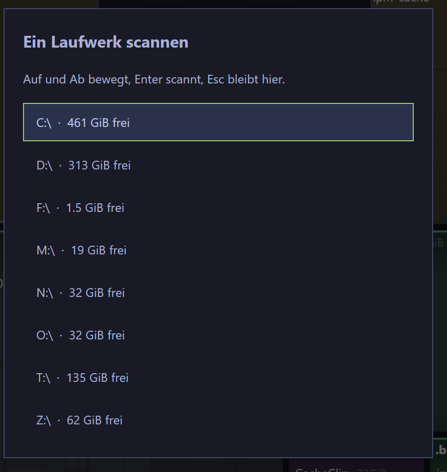
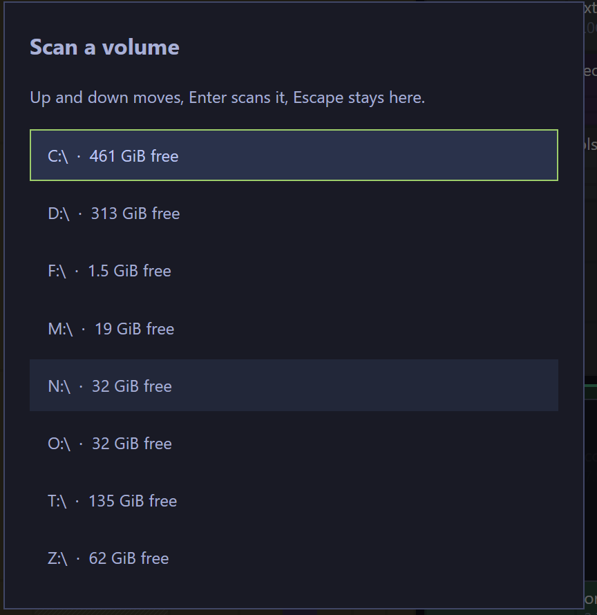

### Problembeschreibung
Volume-Picker: Laufwerke sortiert + aktuelles Laufwerk farbig umrandet

### Akzeptanzkriterien
- [x] Der Picker 'v' listet die Laufwerke nach Name sortiert (Laufwerksbuchstabe aufsteigend, Gross-/Kleinschreibung egal) statt nach freiem Platz.
- [x] Das aktuell gescannte Laufwerk ist in der Liste andersfarbig umrandet und dadurch von den uebrigen Zeilen unterscheidbar, ohne wie eine zweite Auswahl zu wirken.
- [x] Pfeiltasten/Enter/Escape und die Hervorhebung bleiben unveraendert; die Sortierung aendert nur die Anzeige-Reihenfolge.
- [x] Ein Test deckt die Sortierung ab; cargo xtask lint und cargo xtask test bleiben gruen.
- [x] Sichtpruefung der Umrandung des aktuellen Laufwerks durch den Menschen (Screenshot).
### Audit-Log & Agenten-Notizen
- **2026-10-02 09:24:20 (build-opencode):** Ticket claimed by build-opencode
- **2026-10-02 09:24:20 (build-opencode):** Sortierung nach Name + Umrandung des aktuellen Laufwerks im Volume-Picker.
- **2026-10-02 09:27:02 (build-opencode):** Umgesetzt.

- Sortierung: state::sort_volumes_by_name() sortiert die Picker-Liste nach dem Pfad (Laufwerksbuchstabe), case-insensitiv; open_volumes ruft es nach dem Zusammenbau auf. Die Kern-Sortierung nach freiem Platz bleibt unangetastet, der Picker zeigt jetzt C:, D:, F:, ... in Buchstabenfolge.
- Markierung: views::volumes_dialog umrandet die Zeile des aktuell gescannten Volumes (volume_root_for(app.root_path)). Jede Zeile traegt einen 1px-Rand (transparent bei den uebrigen), damit die Umrandung das Layout nicht verschiebt. Farbe theme.success (gruen) - bewusst nicht die Auswahlfarbe accent, damit es nicht wie eine zweite Auswahl wirkt.
- Tests: tests::volume_rows_are_sorted_by_name (Sortierung, case-insensitiv) und tests::the_volume_picker_outlines_the_scanned_volume (debug_selector 'volume-current' nur bei enthaltener aktueller Platte).
- Verifikation Tier 1: cargo xtask lint gruen; cargo xtask test gruen (App 83, Core 146, xtask 3).

OFFEN: Kriterium 5 - Sichtpruefung der Umrandung durch den Menschen.

### Screenshots

