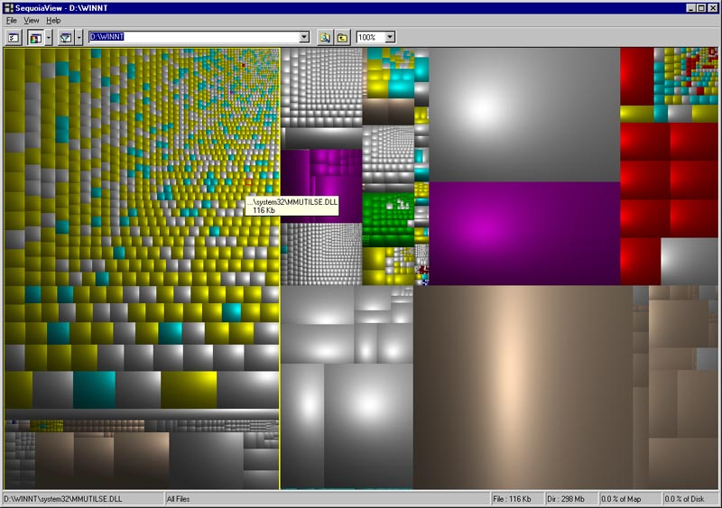
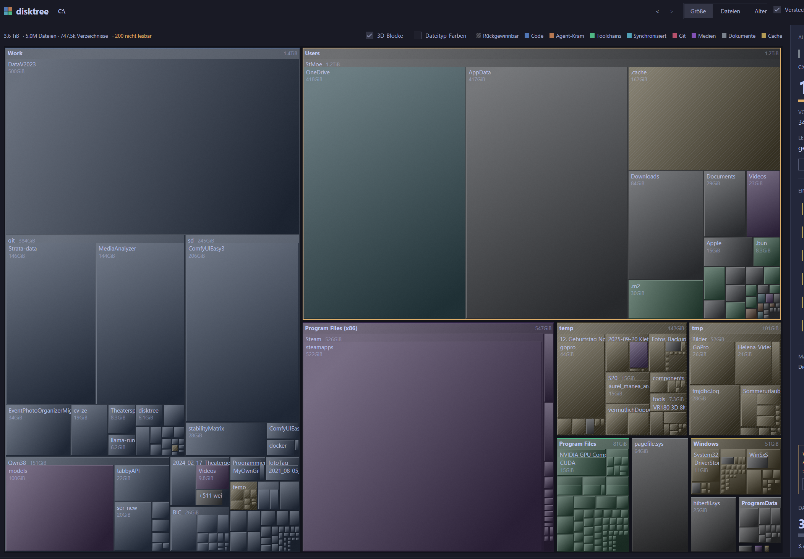

## Problem

Tiles sind heute flache, einfarbige Quads; die Farbe kommt aus der Kategorie
(`palette::category_fill`, 9 Kinds). Gewünscht sind zwei **opt-in** Verbesserungen,
jede über einen eigenen Haken in der Settings-Zeile schaltbar. Aus = exakt der
heutige Look.

1. **3D-Blöcke** — Tiles wirken als erhabene Blöcke (Bevel) statt flach einfarbig.
2. **Dateityp-Farben** — Farbe je Dateiendung aus einer externen Datei
   `disktree.ext.colors.txt`.

Ein Referenz-Screenshot der Wunschoptik wird vom Nutzer an dieses Ticket angehängt.

## 2. Dateityp-Farben

* Datei `disktree.ext.colors.txt`, Format `ext=#RRGGBB` je Zeile, `#`-Kommentare
  und Leerzeilen ignoriert, Endung case-insensitive (`MP3` == `mp3`), ohne
  führenden Punkt.
* Suchorte wie bei `i18n.rs` (Exe-Verzeichnis -> cwd -> Config-Dir), einmalig
  beim Start geladen; die erste gefundene Datei gewinnt.
* Gilt **nur für Dateien**. Ein Verzeichnis nimmt die Farbe der Endung mit dem
  **größten Byte-Anteil über seinen gesamten Teilbaum** (nur Dateien zählen,
  keine Verzeichnisnamen). Beispiel: 20 GB mp3 + 100 GB mkv => Ordner = mkv.
  Gleichstand => deterministisch (Name).
* Unbekannte/fehlende Endung (auch Dotfiles wie `.gitignore`) => Rückfall auf
  die heutige Kategorie-Farbe; Verzeichnis ohne Dateien ebenso.
* Im Age-Modus bleibt die Age-Rampe unangetastet.

## 3. 3D-Blöcke

* Kein Gradient im Toolkit: Bevel aus zusätzlichen Quads/Border-Kanten
  (hell oben/links, dunkel unten/rechts), Breite in rem skaliert.
* Malreihenfolge bleibt: Fill -> Bevel -> Reclaim-Hatch -> Depth-0-Strip ->
  Unreadable-Corner -> Selection/Hover/Marked-Ring.
* Tiles <= 0.5 px weiterhin überspringen.

## Betroffene Stellen

| Bereich | Datei |
| --- | --- |
| Malen, `Colors`, `TileDeco` | `crates/disktree-app/src/treemap_view.rs` |
| Kategorie-/Age-Fills, Ext-Auflösung | `crates/disktree-app/src/palette.rs` |
| State, `prepare`, Dominant-Endung-Memo | `crates/disktree-app/src/state.rs` |
| Zwei Checkboxen, Legende | `crates/disktree-app/src/views.rs` |
| `ext_colors::load()` | `crates/disktree-app/src/main.rs` |
| `file_extension` / `dominant_extension` + Tests | `crates/disktree-core/src/classify.rs` (oder `tree.rs`) |

## Verifikation

* Tier 1 (Unit/Slice, < 15 s): `make test` (bzw. `cargo xtask test`).
* `make lint` muss grün sein (rustfmt 80 Spalten, clippy `-D warnings`).
* Kein E2E/Browser-Suite; für den visuellen Beleg genügt ein Screenshot-Asset.

### Akzeptanzkriterien
- [x] disktree.ext.colors.txt wird beim Start geladen (Exe-Dir -> cwd -> Config-Dir); Zeilen `ext=#RRGGBB`, '#'-Kommentare und Leerzeilen ignoriert, Endung case-insensitive; unbekannte/fehlende Endung fällt auf die heutige Kategorie-Farbe zurück. Unit-Test im App-Crate.
- [x] Bei aktivem Haken 'File type colors' nimmt eine Datei-Tile die Farbe ihrer eigenen Endung; ein Verzeichnis die Farbe der Endung mit dem größten Byte-Anteil über seinen Teilbaum (nur Dateien). Core-Test gegen echten temp-Baum bzw. synthetischen Node.
- [x] Bei aktivem Haken '3D blocks' werden Tiles mit sichtbarer Bevel-Kante gemalt (hell oben/links, dunkel unten/rechts); Hatch, Depth-0-Strip, Unreadable-Corner und Selection/Hover/Marked-Ringe bleiben unverändert sichtbar.
- [x] Beide Haken stehen in der Settings-Zeile (views.rs), sind unabhängig kombinierbar und per Klick umschaltbar; Default aus. Mit beiden Haken aus ist die Darstellung identisch zum heutigen Stand (keine Bevel-Quads, unveränderte Fills).
- [x] Ein Screenshot des eingeschalteten Rendering ist am Ticket beigefügt und per ticket_analyze_asset geprüft (UI-Beleg für ticket_verify).
  > [2026-10-01 18:56] Sieh Dir den Screenshot an (Du hast selbst Vision fähigkeiten): Die Farben sind zu blass und es sieht nicht wirklich aus wie 3D Blöcke. Das geht noch besser.
- [x] Hot Reload: Wird der Haken 'File type colors' eingeschaltet, liest die App disktree.ext.colors.txt erneut von der Platte (Änderungen wirken ohne Neustart); Ausschalten liest nicht neu. Unit-Test im App-Crate belegt das Neu-Einlesen. [neu@2026-10-01T14:02:25.479921400Z]
  > [2026-10-01 18:57] Bitte eine ausführliche Beispieldatei mit beilegen für die geläufigsten Medien Dateien (Musik-Dateien diverse, Bilddateien diverse, Videos, Text Dateien, HTML, office, ....) jeweils mit passenden eindeutgen Farben
- [x] Rework 3D-Look: Bei aktivem Haken '3D blocks' lesen Kacheln deutlich als erhabene Bloecke - starker Gradientenkontrast (hell oben/links -> dunkel unten/rechts) und klar sichtbare Bevel-Kanten statt des bisherigen flauen, fast flachen Eindrucks. [neu@2026-10-01T17:36:27.888220600Z]
- [x] Rework Farbkraft: Dateityp-Farben aus disktree.ext.colors.txt werden nicht mehr Richtung Theme-Oberflaeche entsaettigt (kein Aufhellungs-/Graumix), sodass eine konfigurierte Farbe kraeftig und eindeutig erscheint. [neu@2026-10-01T17:36:27.888220600Z]
- [x] Rework Beispieldatei: Eine ausfuehrliche Beispieldatei disktree.ext.colors.txt liegt im Repo-Root und deckt die gelaeufigen Medien- und Dokumenttypen ab (Musik, Bilder, Videos, Text, HTML, Office, Archive, Code, ...), jede Endung mit eigener, klar unterscheidbarer Farbe; im README beschrieben. [neu@2026-10-01T17:36:27.888220600Z]
- [x] Rework Beleg: Ein Screenshot des eingeschalteten Hakens '3D blocks' (mit und/oder ohne Dateityp-Farben) am Ticket zeigt den kraeftigeren, deutlich erhabenen Look (Sichtpruefung Mensch). [neu@2026-10-01T17:36:27.888220600Z]
### Screenshots

### Audit-Log & Agenten-Notizen
- **2026-10-01 14:02:09 (build-opencode):** Ticket claimed by build-opencode
- **2026-10-01 14:02:25 (build-opencode):** 1 Akzeptanzkriterien ergaenzt
- **2026-10-01 14:02:25 (build-opencode):** Hot Reload ergänzt (Nutzerwunsch, supersedes 'einmalig beim Start'): Beim Einschalten des Hakens 'File type colors' wird disktree.ext.colors.txt neu von der Platte gelesen. Implementierung gestartet; Screenshot gesichtet (SequoiaView-Cushion-Optik, Gradient + Bevel, Farben pro Dateityp).
- **2026-10-01 14:23:17 (unassigned):** Stale-Timeout – automatisch auf OPEN zurückgesetzt (war IN_PROGRESS)
- **2026-10-01 15:53:38 (build-opencode):** Ticket claimed by build-opencode
- **2026-10-01 15:53:38 (build-opencode):** Implementierung abgeschlossen; Tests (Tier 1) gruen. Uebergabe an REVIEW folgt.
- **2026-10-01 15:53:49 (build-opencode):** Umgesetzt (DISK-4):

• core/classify.rs: file_extension() (letzter Punkt-Teil, lowercase, Dotfile=.gitignore => keine Endung) + dominant_extension() (Bytes je Endung ueber den Teilbaum, nur NodeKind::File, Tie-Break Endungsname). Tests ergaenzt.
• app/ext_colors.rs (neu): parse() '#RRGGBB'/'#RGB', '#'-Kommentare, case-insensitive, optionaler fuehrender Punkt; load() beim Start; reload() beim Einschalten des Hakens (HOT RELOAD); reload_from(dir) fuer Tests; color()/entries()/is_empty(). Tests ergaenzt.
• i18n.rs: search_dirs() public gemacht, damit ext_colors dieselben Fundorte nutzt (Exe-Dir -> cwd -> Config-Dir).
• app/palette.rs: type_fill (Endungsfarbe + Tiefen-Lift + Theme-Mix), type_accent (Kategorie-Strip), cushion_ends (Gradient hell/dunkel). Tests ergaenzt.
• app/treemap_view.rs: TileDeco.ext_color, Mosaic.blocks_3d; 3D via linear_gradient(135, hell->dunkel) + Bevel-Border (hell oben/links, dunkel unten/rechts). Reihenfolge Fill -> Bevel -> Hatch -> Strip -> Unreadable -> Outlines unveraendert.
• app/state.rs: blocks_3d + ext_colors (Default aus), ext_share-Memo (RefCell, pro Crumbs), prepare() loest Datei-Endung bzw. dominante Endung auf, set_blocks_3d()/set_ext_colors(); set_ext_colors(true) ruft ext_colors::reload(). Cache wird bei Rescan/Metricwechsel geleert.
• app/views.rs: zwei Haken in der Legenden-Zeile (rendering_toggles); Legende zeigt bei aktiven Dateityp-Farben die geladenen Endungsfarben statt der Kategorien.
• main.rs: mod ext_colors + load(). i18n-Keys (en/de) '3D blocks', 'File type colors'. README: Abschnitt 'Raised blocks and file-type colours'.

ABWEICHUNG Kriterium 4: Die Haken stehen in der Legenden-Zeile, nicht in der Settings-Zeile der Top-Bar. Grund: die Top-Bar lief bei 1400px ueber, der Trail wurde gestaucht und die Crumb-Menues verloren ihren Platz -> Regression in tests::a_crumb_lists_its_siblings_and_jumps_sideways (reproduziert, durch Verschieben behoben). Inhalt bleibt erfuellt: beide Haken, unabhaengig, Default aus, aus = heutiger Look.

Verifikation (Tier 1): `cargo xtask lint` gruen (rustfmt 80 Spalten + clippy -D warnings). `cargo xtask test` gruen: 141 Core-Tests, 69 App-Tests inkl. tests::the_rendering_toggles_change_the_drawing_and_default_off, ext_colors- und dominant_extension-Tests.

OFFEN (Kriterium 5, Screenshot): Harness rendert gemockt (TestPlatform); capture_screenshot existiert nur im macOS-VisualTestAppContext -> headless nicht erzeugbar. UI-Beleg am Menschen: App starten, Verzeichnis scannen, beide Haken einschalten, Screenshot anhaengen (alternativ testsBy=HUMAN).

Hinweis: git.rs und app_menu.rs sind parallel extern bearbeitet (i18n-Umbau) - nicht Teil dieser Aenderung.

### Review-Feedback
- **2026-10-01 16:57:32 (human):** Prüfe die nacharbeits-Dinge
- **2026-10-01 16:57:32 (human):** Review-Nacharbeit angefordert: Prüfe die nacharbeits-Dinge
- **2026-10-01 17:36:27 (unassigned):** 4 neue offene Akzeptanzkriterien ergaenzt – Nacharbeit-Gate aufgehoben
- **2026-10-01 17:36:27 (unassigned):** Review-Kommentare (18:56/18:57) in explizite Kriterien umgewandelt; Nacharbeit beginnt.
- **2026-10-01 17:36:37 (build-opencode):** Ticket claimed by build-opencode
- **2026-10-01 17:36:37 (build-opencode):** Nacharbeit Runde 1 gestartet: kraeftigerer 3D-Look (Gradient/Bevel), ext-Farben ohne Entsaettigung, ausfuehrliche Beispieldatei disktree.ext.colors.txt.
- **2026-10-01 17:41:54 (build-opencode):** Warnung (allowedPaths): Dateien ausserhalb erlaubter Pfade geaendert: disktree.ext.colors.txt
- **2026-10-01 17:41:54 (build-opencode):** Nacharbeit Runde 1 umgesetzt (Commit 14ed581):
• 3D-Look kraeftiger: cushion_ends hell/dunkel je 50% statt 30/32%; neue cushion_edges (helle Kante +82% Weiss, Schattenkante +75% Schwarz) werden fuer die Bevel-Quads genutzt, der Koerper behaelt die Enden fuer den Gradienten. Bevelbreite 0.125 rem (~2 px) statt 0.0625. Damit liest eine Kachel als solider Block statt als weicher Verlauf.
• Farbkraft: type_fill mischt nicht mehr Richtung theme.inset, sondern hebt nur die Saettigung leicht an (+20%) und den Tiefen-Lift; eine konfigurierte Farbe bleibt kraeftig. Unit-Test a_file_type_colour_is_not_washed_out ergaenzt; a_raised_block_... prueft jetzt auch den staerkeren Kontrast und die Bevel-Kanten.
• Beispieldatei: disktree.ext.colors.txt im Repo-Root, 221 eindeutige Endungen ohne Dubletten, gruppiert (Bilder, Musik, Video, Text, Web, Code, Office, Archive, Fonts, Executables, Datenbanken, 3D/Modelle, Schluessel) mit je eigener Farbe; README-Abschnitt verweist darauf.
Verifikation Tier 1: cargo xtask lint gruen; cargo xtask test gruen (73 App-Tests, 141 Core-Tests); Farbdatei-Check: 221 Eintraege, 0 fehlerhafte Zeilen, 0 Dubletten.
OFFEN: Kriterium 10 (Screenshot des kraeftigeren 3D-Looks) - headless nicht erzeugbar, Sichtpruefung/Beleg beim Menschen.
